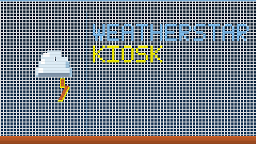
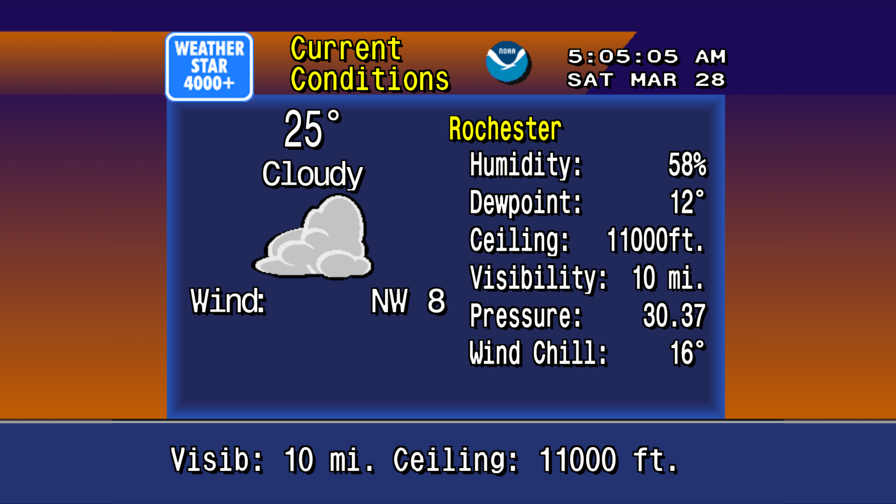
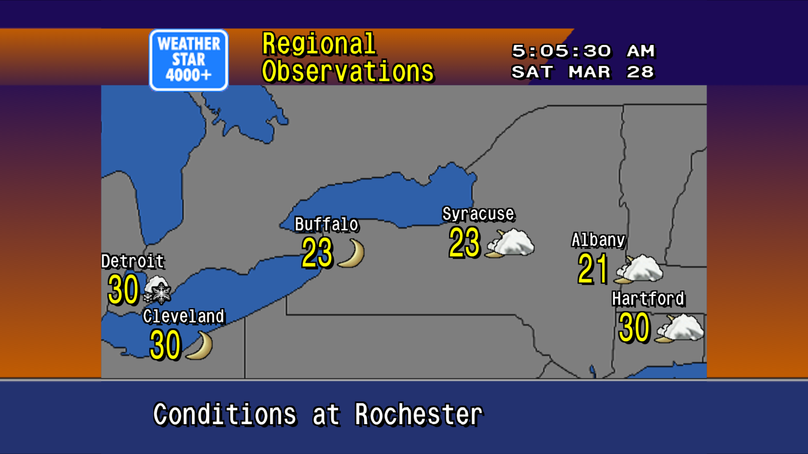
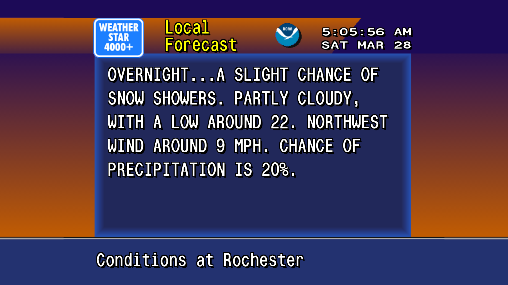
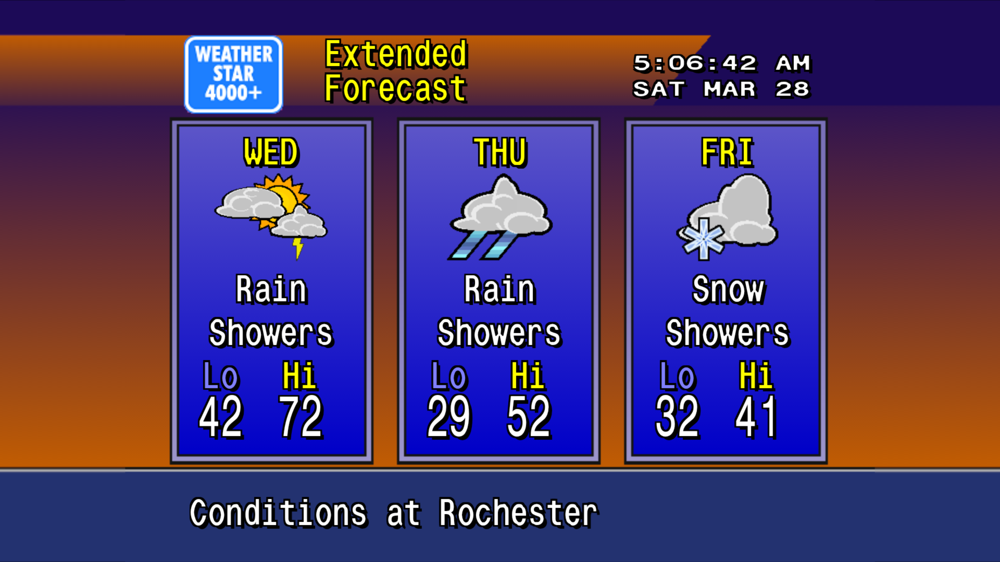

# WeatherStar Kiosk

An Android kiosk app that displays the [WeatherStar 4000+](https://github.com/netbymatt/ws4kp) retro weather experience full-screen on a TV or tablet — no interaction required.



## Screenshots

| Current Conditions | Regional Observations |
|---|---|
|  |  |

| Local Forecast | Extended Forecast |
|---|---|
|  |  |

## Features

- Full-screen WeatherStar 4000+ weather display with retro animations
- Automatic location detection via GPS → IP geolocation fallback
- Background retro weather music from Archive.org
- Long-press anywhere to open settings
- Runs on Android 4.4+ (API 19) through current

## Settings

Long-press the screen (1.5 s) to open the settings overlay:

| Setting | Description |
|---------|-------------|
| **Location** | Auto (GPS + IP geo) or manual lat,lon entry |
| **Re-detect** | Clear saved location and re-run detection |
| **Music** | On / Off |
| **Display** | Brightness control |
| **IP geolocation** | Disable if you prefer a fixed location |

When IP geolocation is disabled, a fixed location can be set via **Change** in the About section. The app will prompt for coordinates if none are saved.

## Install

Download `weatherstarkiosk-1.0-signed.apk` from [Releases](https://github.com/cyberbalsa/retroweather/releases) and sideload it, or install via the Play Store.

To sideload:
```
adb install weatherstarkiosk-1.0-signed.apk
```

## Beta Testing

I'm looking for beta testers! If you'd like to try the latest builds before they hit the Play Store, see [TESTING.md](TESTING.md) for how to join the closed test.

## Credits

Based on [WeatherStar 4000+](https://github.com/netbymatt/ws4kp) by netbymatt — MIT License.
Music from the [Weatherscan Complete Collection](https://archive.org/details/weatherscancompletecollection) on the Internet Archive.
IP geolocation by [ipinfo.io](https://ipinfo.io) and [ipapi.co](https://ipapi.co) when GPS is unavailable.

## Build

```bash
./gradlew assembleRelease    # APK
./gradlew bundleRelease      # AAB (Play Store)
```

Signing requires a YubiKey Security Key (FIDO2). See [sign-release.sh](sign-release.sh).

## License

MIT
